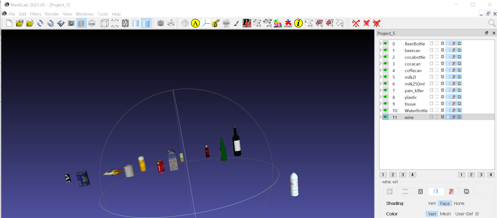

# Webots World (Ver 1.0.2) 

__[실행환경]__
* Ubuntu 18.04 
* ROS Melodic  
* Nvidia GPU driver (CUDA 11.2 지원이 가능한 GPU 디바이스. e.g., GTX 1080Ti)

<br/>

__[Content]__
* [Installation](https://github.com/DoranLyong/webots-ros-melodic-project#installation)
  * [로컬 PC에 universal_robot ROS 패키지 설치하기](https://github.com/DoranLyong/webots-ros-melodic-project#%EB%A1%9C%EC%BB%AC-pc%EC%97%90-universal_robot-ros-%ED%8C%A8%ED%82%A4%EC%A7%80-%EC%84%A4%EC%B9%98%ED%95%98%EA%B8%B0)
  * [Webots World 설치하기](https://github.com/DoranLyong/webots-ros-melodic-project#webots-world-%EC%84%A4%EC%B9%98%ED%95%98%EA%B8%B0)

* [Robot Control](https://github.com/DoranLyong/webots-ros-melodic-project#robot-control)
  * [로컬 PC에서 Webots World 제어하기](https://github.com/DoranLyong/webots-ros-melodic-project#%EB%A1%9C%EC%BB%AC-pc%EC%97%90%EC%84%9C-webots-world-%EC%A0%9C%EC%96%B4%ED%95%98%EA%B8%B0)

* [대회 준비를 위한 Tip](https://github.com/DoranLyong/webots-ros-melodic-project#%EB%8C%80%ED%9A%8C-%EC%A4%80%EB%B9%84%EB%A5%BC-%EC%9C%84%ED%95%9C-tip)

<br/>

__[Tutorial]__
* 설치 및 사용방법에 대한 [영상자료](https://youtu.be/VFg2d6c4jjM)

<br/>

***


## Installation 

### 로컬 PC에 __universal_robot__ ROS 패키지 설치하기 
#### 0. PC OS환경에 맞게 ROS 설치 
 * (18.04 : melodic, 20.04 : noetic); [ros install](http://wiki.ros.org/ROS/Installation)<br/> 
#### 1. [universal_robots](http://wiki.ros.org/universal_robots) 패키지 설치 <br/>
  * ```apt-get``` 이 아닌 ```git clone```으로 소스 빌드할 것을 권장 
  ```bash 
  cd $HOME/catkin_ws/src

  # retrieve the sources (replace '$DISTRO' with the ROS version you are using)
  # 아직 noetic버전이 없기 때문에 melodic-devel 버전으로 깃클론 
  git clone -b melodic-devel https://github.com/ros-industrial/universal_robot.git  

  cd $HOME/catkin_ws

  # checking dependencies (replace '$DISTRO' with the ROS version you are using)
  rosdep update
  rosdep install --from-paths src --ignore-src --rosdistro $ROS_DISTRO

  # building
  catkin_make

  # source this workspace (careful when also sourcing others)
  source $HOME/catkin_ws/devel/setup.bash
  ```

#### 2. ```ROS_NETWORK```는 다음과 같이 설정 

    ```bash
    # 로컬 PC의 ~/.bashrc 에서 

    export ROS_IP=x.x.x.x   # 로컬 PC의 이더넷 IP 
    export ROS_HOSTNAME=$ROS_IP
    export ROS_ROS_MASTER_URI=http://$ROS_IP:11311   # eth IP of your local PC for ROS Master 
    ```
    
    ```bash
    # 경기장에서 대회 참여자의 로컬 PC의 ~/.bashrc 예시 

    export ROS_IP=x.x.x.x   # 대회 참여자의 이더넷 IP 
    export ROS_HOSTNAME=$ROS_IP
    export ROS_ROS_MASTER_URI=http://<경기장 PC의 IP>:11311   # eth IP for ROS Master 
    ```
    
    * 끝난 뒤 반드시 ```~$ source ~/.bashrc```


### Webots World 설치하기 
#### 1. Install Docker and Nvidia-docker 
* Docker Engine을 [설치](https://docs.docker.com/engine/install/ubuntu/)
* Docker Compose를 [설치](https://docs.docker.com/compose/install/)
* Nvidia-docker를 [설치](https://docs.nvidia.com/datacenter/cloud-native/container-toolkit/install-guide.html#docker)
* 루트(root) 권한 설정; ```sudo``` 없이 도커 사용하기 
  ``` bash
  ~$ sudo usermod -aG docker $USER #현재 접속중인 사용자에게 권한주기 
  ```

#### 2. Pull and Install the docker image 
* 현재 깃허브 레포지토리에 있는 파일을 가지고 아래 명령어를 순서대로 실행 
```bash
~$ git clone https://github.com/DoranLyong/webots-ros-melodic-project.git

~$ cd ./webots-ros-melodic-project

~$ sudo chmod a+x make_webots-ros_container.bash run_webots-ros_container.bash  # 실행 권한 부여 

~$ ./make_webots-ros_container.bash  # 도커 이미지 설치 및 컨테이너 생성 

~$ ./run_webots-ros_container.bash   # webots world가 설치된 컨테이너 실행 

```
<br/>

* 해당 컨테이너를 다시 실행하고 싶다면 ```~$ ./run_webots-ros_container.bash```
* 도커 컨테이너의 ```~/.bashrc```에서 ```ROS_IP```, ```ROS_HOSTNAME```, ```ROS_MASTER_URI``` 환경 변수 값을 아래와 같이 할당[(참고 링크)](https://www.ybliu.com/2020/05/ros-remote-debgging-and-communication.html): 

```bash 
# 도커의 ~/.bashrc 에서 

export ROS_IP=172.17.0.x  # in the docker container for webots world
                          # 현재 생성된 도커 컨테이너의 주소를 확인하고 입력하기  
export ROS_HOSTNAME=$ROS_IP
export ROS_ROS_MASTER_URI=http://172.17.0.1:11311   # docker IP of your local PC for ROS Master 
```
* 끝난 뒤 반드시 ```~# source ~/.bashrc```

  

#### 3. Run the webots world and Connect with ROS in the docker container (여기서 부터는 도커 환경에서...)
* 로컬 PC 에서 ```roscore``` <br/>

__Method 01__. 도커 환경에서 아래 명령어를 각각 실행 (각각 새로운 도커 터미널에서 실행)
```bash
~# webots

~# ~/ur_e_webots.bash   # webots world의 스텝을 실행시킬 수 있는 ROS 패키지 실행 

~# ~/sensor_enable.bash  # webots world의 센서 장비가 토픽을 ROS_MASTER터로 발행하도록 서비스 요청(call)

~# python ~/objects_random_place.py --seed=42   # 물체 위치 랜덤 
```
<br/>

__Method 02__. 위의 명령은 다음과 같이 간략하게 실행가능 
```bash
~# ~/run_WebotsWorld_all.bash  # webots -> ur_e_webots.bash -> sensor_enable.bash 순으로 실행됨 

~# python ~/objects_random_place.py --seed=42   # 새로운 도커 터미널에서 실행할 것 
```
<br/>

※ 두 방법중에 하나라도 빠짐없이 실행되어야 webots world가 실행된다.


***
## Robot Control 

### 로컬 PC에서 Webots World 제어하기 


#### 1. 영상 데이터
```bash 
# RGB image topic 
/CAM/camera/image

# Depth image topic 
/CAM/range_finder/range_image
```
* 영상 데이터의 메시지 타입은 ```sensor_msgs/Image```
* [Image topic subscribe](https://github.com/DoranLyong/webots-ros-melodic-project/blob/main/catkin_ws/src/ur_e_webots/scripts/webots_ros_tutorial.py) 예시 

##### ※ Camera world → Robot world 변환 행렬을 구하기 위한 파라미터 
```bash 
[RGB & depth_map devices]

- Translation[x, y, z] : 1.35272 , 1.3315 , 5.97883e-07
- Rotation(quaternions)[w, x, y, z] : 0.653284 , -0.270596 , 0.65328 , 0.270597

[UR10e robot base]
- Translation[x, y, z] : 0 , 0.7 , -1.00693e-08
- Rotation(quaternions)[w, x, y, z] : -0.707107 , 0.707107 , 0 , 0 

[World center] 
- Translation[x, y, z] : 0 , 0 , 0 
- Rotation(quaternions)[w, x, y, z] : 1 , 0 , 0 , 0 

```


#### 2. UR10 로봇 제어

##### (1) MoveIt 활용 예시 
  ```bash  
  # 도커 컨테이너의 Webots World에서 좌측 상단에 TimeStep이 동작하는지 확인한 후 실행
  
  # MoveIt 연동 패키지 예시 
  ~$ roslaunch ur10_e_moveit_config ur10_e_moveit_planning_execution.launch
  
  ~$ roslaunch ur10_e_moveit_config moveit_rviz.launch config:=true   
  ```
* 여기까지 실행이 끝났다면 webots의 가상환경이 MoveIt과 연동되어 제어되는 것을 확인할 수 있다 
* [User Guide](https://cyberbotics.com/doc/guide/ure?tab-language=python#ros) 참고 
 

##### (2) 커스텀 제어 예시 - Grippers & URe joints 제어 
 * 간단한 Gripper 조작을 위한 토픽 발행 형태는 ```~$ rostopic pub /grp_follow_joint_trajectory/goal control_msgs/FollowJointTrajectoryActionGoal``` 을 통해 제어할 수 있음 
     * [간단한_핸드조작_토픽_pub.txt](https://github.com/DoranLyong/webots-ros-melodic-project/blob/main/%EA%B0%84%EB%8B%A8%ED%95%9C_%ED%95%B8%EB%93%9C%EC%A1%B0%EC%9E%91_%ED%86%A0%ED%94%BD_pub.txt) 
     * [사용된 Gripper의 joints 정보](https://cyberbotics.com/doc/guide/gripper-actuators#robotiq-3f-gripper)
 * UR10e 로봇도 유사한 방식으로 ```~$ rostopic pub /follow_joint_trajectory/goal control_msgs/FollowJointTrajectoryActionGoal``` 을 통해 제어 가능

    * 자세한 UR10 로봇 제어과 관련된 내용은 [메뉴얼](https://cyberbotics.com/doc/guide/ure)을 참고 
    * [ur_e_webots 코드](https://github.com/cyberbotics/webots/blob/released/projects/robots/universal_robots/resources/ros_package/ur_e_webots/scripts/universal_robots_ros.py)를 바탕으로 webots world가 설계됨 
    * [webots_ros를 통한 컨트롤러 예시](https://github.com/cyberbotics/webots_ros/tree/master/scripts)
    * [UR10e 로봇의 joints 정보](https://cyberbotics.com/doc/guide/ure?tab-language=python)  

##### (3) Gripper에 [distance sensor](https://cyberbotics.com/doc/reference/distancesensor?tab-language=ros#distancesensor-functions)추가 
* 아래 토픽으로 Subscribe 가능
* [std_msg/Range](http://docs.ros.org/en/melodic/api/sensor_msgs/html/msg/Range.html) 타입으로 ```range```, ```max_range```, ```min_range``` 값을 받을 수 있음
```bash 
/gripper_distance_sensor     # rostopic name 
```


#### 3. 기타 
* 그 이외 webots과 관련된 내용은 [webots_ros github](https://github.com/cyberbotics/webots_ros) 및 [ros.org의 webots 위키](http://wiki.ros.org/webots) 참고

***

### 대회 준비를 위한 Tip
[경기 내용]
* 경기는 물리적으로 분리된 두 대의 컴퓨터로 진행된다. 
* 한 대는 ```ROS_MASTER```와 ```webots world```가 실행될 경연 당일 준비될 경기장 컴퓨터(주최 측에서 준비), 다른 하나는 대회 참여자의 개인 컴퓨터이다. 
* 경기장 컴퓨터는 ```ROS_MASTER``` 및 ```webots world```가 실행되는 서버 역할이다. 
* 대회 참여자의 ```ROS_HOST```는 ```ROS_MASTER``` 에 연결되어 ```webots world```로 부터 센싱 데이터를 받고 UR10e 로봇 제어를 통해 재활용 쓰레기를 분리수거 하는 과업(task)을 수행한다. 
* 매 경기마다 물체의 위치는 랜덤으로 생성된다; ```~(도커 컨테이너)# python ~/objects_random_place.py 활용``` 

[대회 참여자가 준비해야할 코드]
* webots world의 [UR10e](https://cyberbotics.com/doc/guide/ure) 로봇과 [Gripper](https://cyberbotics.com/doc/guide/gripper-actuators#robotiq-3f-gripper)는 [actionlib.ActionServer()](https://docs.ros.org/en/api/actionlib/html/classactionlib_1_1ActionServer.html) 노드로 제어할 수 있다. 
* 따라서, 대회 참여자는 [actionlib](http://wiki.ros.org/actionlib#Action_Specification:_Goal.2C_Feedback.2C_.26_Result)를 활용해 [actionlib.ActionServer](https://docs.ros.org/en/api/actionlib/html/action__server_8py_source.html)의 ```goal``` 값으로 [UR10e](https://cyberbotics.com/doc/guide/ure) 와 [Gripper](https://cyberbotics.com/doc/guide/gripper-actuators#robotiq-3f-gripper) 관절(joints)을 제어하는 값을 입력으로 발행하면 된다.
    * [간단한_핸드조작_토픽_pub.txt](https://github.com/DoranLyong/webots-ros-melodic-project/blob/main/%EA%B0%84%EB%8B%A8%ED%95%9C_%ED%95%B8%EB%93%9C%EC%A1%B0%EC%9E%91_%ED%86%A0%ED%94%BD_pub.txt) 참고 
* [UR10e.urdf](https://github.com/DoranLyong/webots-ros-melodic-project/blob/main/UR10e.urdf) 파일은 현재 레포지토리에 첨부되어 있다.

 ```bash
 # 사용할 관절 목록 
 
 [UR10e의 관절 목록]
 - shoulder_pan_joint
 - shoulder_lift_joint
 - elbow_joint
 - wrist_1_joint
 - wrist_2_joint
 - wrist_3_joint
 
 
 [Gripper의 관절 목록]
 - finger_1_joint_1
 - finger_2_joint_1
 - finger_middle_joint_1
 ```

#### [Notice]
* 물체 인식을 위한 ```학습 Dataset은 따로 제공하지 않습니다```. 
    * webots 도커에서 ```~# python ~/objects_random_place.py```을 활용해 매번 랜덤으로 배치되는 장면을 바탕으로 각 팀별로 레이블링 하시기 바랍니다. 
* webots world에 활용된 물체의 ```.wrl``` 파일과 ```Texture``` 이미지는 [objects_wrl](https://github.com/DoranLyong/webots-ros-melodic-project/tree/main/objects_wrl) 폴더에 업로드 되었습니다.
    * [MeshLab](https://www.meshlab.net/) 프로그램을 사용하면 간단하게 확인 가능 
    
      


#### (2021/10/19 업데이트) rviz-moveit-v1.0.4 로 업데이트 ([참고](https://github.com/DoranLyong/webots-ros-melodic-project/blob/main/make_webots-ros_container.bash))
 - [x] timestep := 16 으로 수정; 물리엔진의 부하를 줄이기 위해
 - [x] tissue(휴지) 오브젝트 제거; 물리엔진이 복잡해서 제거됨 
 - [x] plastic_bag(과자봉지)의 물리엔진 수정됨 (물리영역 폭 증가)
 - [x] 문제 랜덤 위치 실행 코드에 seed 추가 
    ``` bash
    ~# python ~/objects_random_place.py --seed=42  # 물체 랜덤 위치에 시드 부여
    ```

***

#### Reference 
* [ROS](http://wiki.ros.org/Distributions) & [webots](https://cyberbotics.com/) 설치 
* [universal_robots](http://wiki.ros.org/universal_robots) 설치 
* [WEBOTS_HOME](https://cyberbotics.com/doc/guide/tutorial-8-using-ros) 환경변수 설정 
* [UR 로봇 프로젝트 파일을 catkin_ws로 옮기고](https://cyberbotics.com/doc/guide/ure) rviz에 띄우기 
* webots의  URe 로봇 모델을 ROS로 보내기 위해서는 → webots 월드에서 URe의 컨트롤러를 ```extern```


```
MIT License

Copyright (c) 2021 Guhnoo yun, Kijung Kim, Jeongho Lee 

Permission is hereby granted, free of charge, to any person obtaining a copy
of this software and associated documentation files (the "Software"), to deal
in the Software without restriction, including without limitation the rights
to use, copy, modify, merge, publish, distribute, sublicense, and/or sell
copies of the Software, and to permit persons to whom the Software is
furnished to do so, subject to the following conditions:

The above copyright notice and this permission notice shall be included in all
copies or substantial portions of the Software.

THE SOFTWARE IS PROVIDED "AS IS", WITHOUT WARRANTY OF ANY KIND, EXPRESS OR
IMPLIED, INCLUDING BUT NOT LIMITED TO THE WARRANTIES OF MERCHANTABILITY,
FITNESS FOR A PARTICULAR PURPOSE AND NONINFRINGEMENT. IN NO EVENT SHALL THE
AUTHORS OR COPYRIGHT HOLDERS BE LIABLE FOR ANY CLAIM, DAMAGES OR OTHER
LIABILITY, WHETHER IN AN ACTION OF CONTRACT, TORT OR OTHERWISE, ARISING FROM,
OUT OF OR IN CONNECTION WITH THE SOFTWARE OR THE USE OR OTHER DEALINGS IN THE
SOFTWARE.
```

